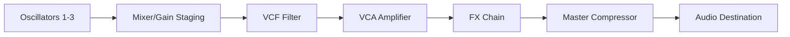

# Git-Dat VST

> Live WebApp: https://dovvnloading.github.io/GitDat-VST/

---


---


**Git-Dat VST** is a high-fidelity, subtractive synthesizer running entirely in the browser via the Web Audio API. It features a custom-built DSP engine, a 3-oscillator architecture, and an intelligent genetic evolution algorithm for stochastic patch generation.

Designed to replicate the workflow and sonic characteristics of desktop VST plugins, this application functions without external audio processing libraries, relying solely on native browser audio nodes for low-latency performance.

## System Architecture

The audio engine is constructed using a modular node graph approach within the `AudioContext`. The signal flow mimics hardware subtractive synthesis:



### Core Features

*   **Triple Oscillator Engine:** 
    *   Three independent oscillators per voice.
    *   Selectable waveforms: Sine, Square, Sawtooth, Triangle.
    *   Fine-tune (+/- 50 cents) and Semitone (+/- 24) controls.
*   **Voltage Controlled Filter (VCF):**
    *   State-variable filter implementation (Lowpass, Highpass, Bandpass).
    *   Dedicated ADSR envelope for filter modulation.
    *   Resonance control capable of self-oscillation characteristics.
*   **Modulation Matrix:**
    *   Global LFO with routable targets (Pitch, Filter Cutoff, Amplifier).
    *   Variable LFO shapes and rate synchronization.
    *   Standard ADSR Amp Envelope.
*   **Effects Processing Unit:**
    *   **Hyper Unison:** A dimension-expander style chorus utilizing stereo delay lines and phase-offset LFO modulation for wide stereo imaging.
    *   **Stereo Delay:** Feedback delay network with dry/wet mixing.
    *   **Plate Reverb:** Convolution reverb utilizing algorithmically generated impulse responses for realistic decay texturing.
*   **Polyphony Management:**
    *   Selectable Polyphonic (up to 16 voices) and Monophonic modes.
    *   Legato Glide/Portamento implementation with exponential pitch ramping.

## Intelligent Patch Evolution

Git-Dat VST implements a genetic algorithm (`patchEvolution.ts`) to generate new presets programmatically. Unlike standard randomization, this engine uses constraints to ensure musicality:

1.  **Harmonic Locking:** Oscillator semitones drift based on harmonic intervals (-12, 0, +7, +12) rather than random integers.
2.  **Gain Compensation:** Master volume adapts dynamically based on Unison spread and Delay feedback levels to prevent clipping.
3.  **Bass Logic:** If oscillators are tuned to sub-bass frequencies, waveforms are biased towards Sawtooth or Square waves for audible harmonic content.
4.  **Filter Protection:** Resonance is clamped relative to cutoff frequency to prevent ear-damaging feedback loops in the low-end.

## Installation and Development

To run the synthesizer locally, ensure Node.js (v18+) is installed.

1.  **Clone the repository**
    ```bash
    git clone https://github.com/yourusername/git-dat-vst.git
    cd git-dat-vst
    ```

2.  **Install dependencies**
    ```bash
    npm install
    ```

3.  **Start the development server**
    ```bash
    npm run dev
    ```

4.  **Build for production**
    ```bash
    npm run build
    ```

## Keyboard Mapping

The application utilizes a standard tracker-style keyboard layout to map QWERTY keys to MIDI notes.

*   **Lower Octave:** `Z` through `M` (White keys), `S`, `D`, `G`, `H`, `J` (Black keys).
*   **Upper Octave:** `Q` through `P` (White keys), `2`, `3`, `5`, `6`, `7` (Black keys).
*   **Octave Control:** Use the on-screen UI buttons to shift the base octave +/- 3.

## Technical Specifications

*   **Audio Standard:** Web Audio API (AudioContext)
*   **Sample Rate:** System Default (typically 44.1kHz or 48kHz)
*   **FFT Size:** 2048 bins (for visualizer analysis)
*   **Latency:** Dependent on host buffer size (typically <10ms)
*   **Framework:** React 19.2
*   **Language:** TypeScript 5.8

## License

This project is licensed under the MIT License. See the `LICENSE` file for details.

---

**Prototype Status:** This software is currently in Beta. While the DSP engine is stable, high voice counts (>12) combined with long reverb tails may impact performance on mobile devices.
